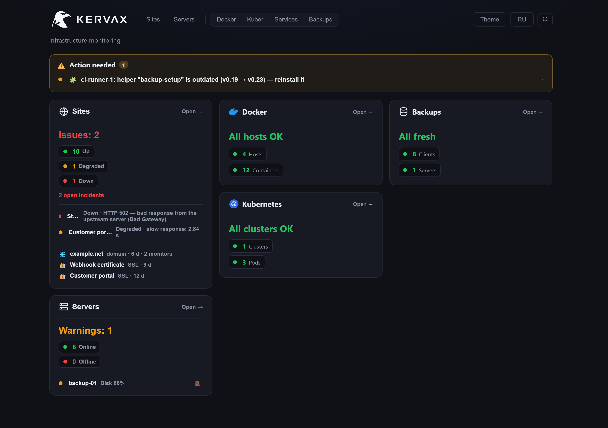
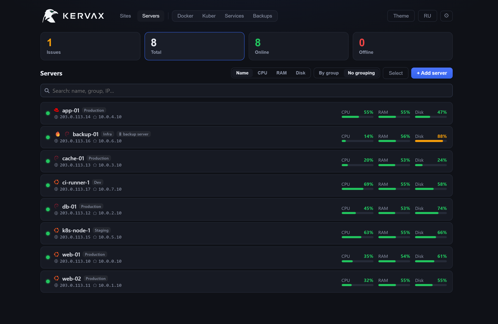
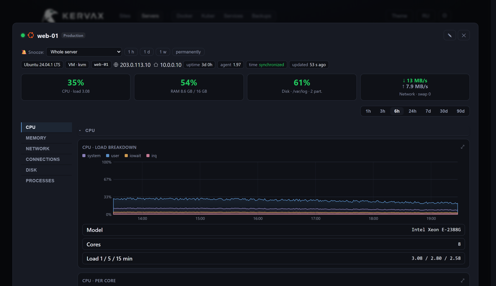
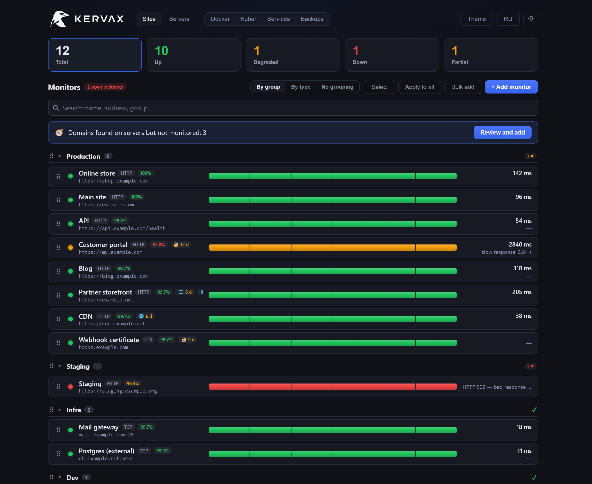
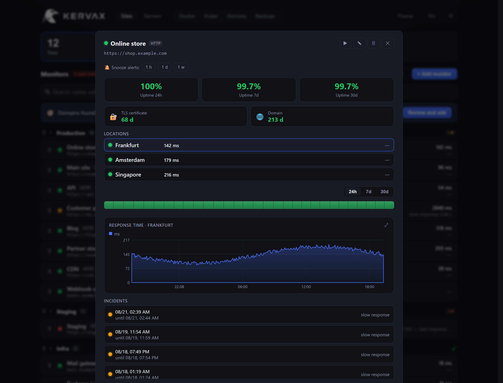
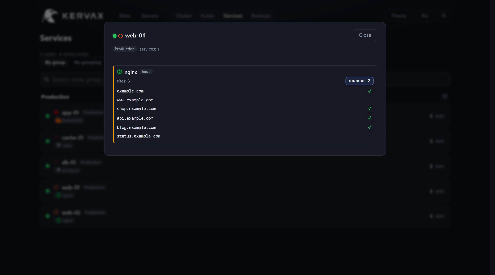
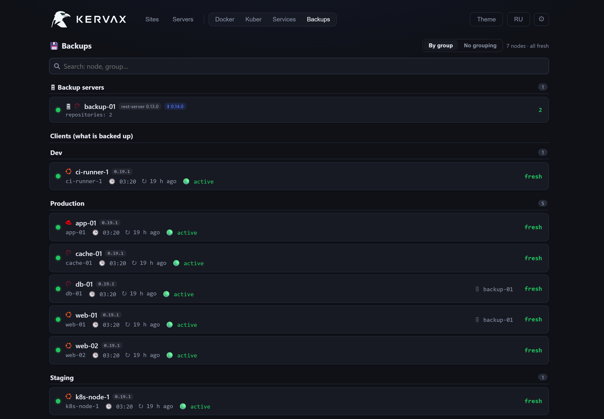

# Kervax

Enterprise-grade monitoring that is ready to use right after installation: sites,
servers, containers, databases and backups in one panel. The install runs as a
single command, the agent detects what runs on each machine, dashboards fill in
from the first check, and alerts go to Telegram or a webhook.

Infrastructure is visible from both sides at once. From the outside, through
external checks: response code, keyword, response time, certificate and domain
expiry, including through proxies in other networks. From the inside, through an
agent that uses **outbound** connections only: no port is opened on the node, and
the panel stores a hash of the agent token rather than the token.

[Русская версия](README.ru.md) · [kervax.ru](https://kervax.ru) · [Install guide](docs/install.md) · [Why another monitoring panel](docs/why.md) · [Changelog](CHANGELOG.md)

```bash
curl -fsSL https://raw.githubusercontent.com/mihsergeev/Kervax/main/ops/quickstart.sh | sudo sh
```

That single command installs Docker if needed, brings up Caddy with a real
Let's Encrypt certificate, and prints the panel's address and admin password. No
domain of your own required — `<server-ip>.sslip.io` works out of the box.



<table>
<tr>
<td width="50%"><a href="docs/img/servers.png"></a><br><sub>Servers: the fleet with current load</sub></td>
<td width="50%"><a href="docs/img/server-detail.png"></a><br><sub>Server card: CPU, memory, disks, network, processes</sub></td>
</tr>
<tr>
<td width="50%"><a href="docs/img/sites.png"></a><br><sub>Sites: availability, certificates, domains, checks from several locations</sub></td>
<td width="50%"><a href="docs/img/site-detail.png"></a><br><sub>Monitor card: availability, response time per location, incidents</sub></td>
</tr>
</table>

<sub>The screenshots are taken from a running panel on demo data;
the same frontend that ships in the image. Every host, domain and address in
them is invented (RFC 2606 / RFC 5737). See <a href="docs/make-shots.py">docs/make-shots.py</a>.</sub>

---

## What it does

**Sites, checked from outside.** HTTP(S) with auto-detected scheme, expected
status, a keyword that must (or must not) appear; TCP ports; TLS certificate and
domain-registration expiry. Retries and "alert after N failures in a row" are
per-monitor, so a single network blip never wakes anyone.

**From more than one place.** Add proxy locations and the same monitor runs from
them too. When a site answers you but not Singapore, the panel says **partial**
and names the location instead of reporting a green light — it also tells you
when a probe location itself is the thing that broke.

**Expiry that arrives in time.** TLS and domain deadlines escalate (14 / 7 / 1
days), are counted by whole days, and are grouped by the name you actually renew:
five monitors on `*.example.com` are one domain, and you get one warning, not
five.

**Servers through an agent that connects out.** A single static Go binary reports
CPU (with per-core and breakdown), memory and swap, disks per mount, network per
interface, disk I/O, sockets and conntrack, temperature, throttling, OOM kills,
reboots and the process tops. It runs as an unprivileged `kervax` user under
systemd with `NoNewPrivileges`, and it never listens on a port.

**What runs on those servers.** Docker containers and Kubernetes pods, web
servers and the sites they serve, databases and their sizes, RabbitMQ queue
depth. Domains found on a node's nginx or an Ingress can be put under monitoring
in two clicks — the panel shows what it found and which of it is already watched.

**What expires before it breaks.** Clusters die on dates: a Flux token runs out
and nothing is delivered any more, while everything already running keeps running
and every dashboard stays green. Kervax reads the expiry of control-plane and
kubelet certificates, kubeconfigs, TLS secrets and the credentials Flux uses to
reach Git — and warns two weeks ahead. It also watches the `Ready` state of Flux
resources, for the case where a token is revoked rather than expired. The dates
are computed by a root helper on the node itself: no key material and no token
value ever reaches the panel.

**Sites closed from outside.** An internal panel, a Grafana, an n8n behind an IP
allow-list: the panel cannot reach them, and the monitor would sit at "down"
forever. Such a site is probed by the agent from inside the server — it knocks on
`localhost` with the right host name and reports back. It only ever connects to
localhost, so the panel cannot send it anywhere else; what leaves the node is a
status code and a latency, not the page. In the list such a monitor is marked
"local".



**Backups.** Status of restic backups per node, repositories on your rest-server,
whether a backup fits its night window, and a vault of restore credentials that
is encrypted **in your browser** — the panel never learns the vault password, so
a dump of its database is worth nothing.



**It tells you what needs doing.** An outdated helper script on a node, an agent
older than the release, a probe location that stopped working, a clock that
drifted — all of it lands in "Action needed" instead of silently degrading. A
monitoring panel that quietly stops noticing things is worse than none.

**Alerts you can live with.** Telegram or webhook, editable text per alert type,
scoped to all nodes / a group / a pick; sustained-threshold alerts instead of
spike alerts; snooze, per-signal mute, and per-user routing so that people only
get alerts about what they are responsible for.

## Security

- The agent connects **out** over HTTPS. The panel never opens a connection into
  your servers and keeps only a SHA-256 of each agent token.
- The panel refuses to start with a default or weak secret; passwords are at
  least 12 characters. Sign-in is JWT plus optional TOTP, with login
  rate-limiting and an audit log.
- Nothing runs as root: the backend is uid 10001, the frontend is the
  unprivileged nginx image, and every container has `no-new-privileges`.
- Roles are enforced in the API, not just in the UI: an account limited to a
  group cannot reach objects outside it even by guessing an id. Two scripts keep
  it that way — `ops/selfcheck.py` (static, runs in CI and as a pre-commit hook)
  and `ops/audit_live.py`, which probes a **running** panel with temporary
  accounts of each role.
- Agent auto-updates, if you enable them, are gated by an **offline** signing key
  rather than by the panel: a fully compromised panel still cannot make agents
  run arbitrary code.
- Worth knowing: anyone who can create a monitor can point it at any URL the
  panel can reach, including addresses that are internal to it. Response bodies
  never reach the UI (only the status code and whether a keyword matched), but
  treat the `editor` role accordingly.

Threat model and deployment notes: [docs/security.en.md](docs/security.en.md).

## Out of the box

A Prometheus stack is assembled: an exporter per concern, a scrape config, rules,
Alertmanager routes, and a Grafana dashboard per thing you want to see. That is
power, and it is also a weekend. Kervax is the other trade-off — the same jobs,
already wired:

| To get this | With Kervax | The usual stack |
| --- | --- | --- |
| Metrics from a new server | one command on the node, data in seconds | install node_exporter, add a scrape target (or set up service discovery), reload Prometheus, import a dashboard |
| A site checked from outside | type the address | blackbox_exporter, a job with relabeling, a rule, a panel |
| TLS expiry | counted automatically, escalating reminders | a blackbox probe plus a PromQL rule |
| Domain registration expiry | counted automatically | nothing off the shelf — write an exporter |
| Uptime over 30 days | a number on the card | a recording rule and a PromQL query |
| Incidents | opened and closed on their own, with history | Alertmanager: routes, grouping, inhibition, silences — in config files |
| Containers, pods, databases, queues | discovered by the agent | cAdvisor, kube-state-metrics, postgres_exporter, rabbitmq_exporter… |
| Backup status | restic state per node, in the panel | not covered |
| Who sees what | roles and groups, enforced in the API | Grafana orgs plus separate access to Prometheus |
| Storage | pruned on a schedule you set | retention tuning, and Thanos/Mimir when it grows |
| Dashboards | there when you sign in | build or import them |

Nothing here is a knock on Prometheus: for application metrics and ad-hoc PromQL
it remains the better tool, and the two coexist perfectly well. Kervax covers
infrastructure — the host, the site, the certificate, the backup — and covers it
without a configuration project. **[What it deliberately does not do →
docs/why.md](docs/why.md)**

## Requirements

- A Linux server with Docker and Compose. 2 GB of RAM is enough.
- Ports 80 and 443 free, or your own reverse proxy in front.
- No external services: metrics, incidents and history live in your Postgres.

## Quick start

```bash
curl -fsSL https://raw.githubusercontent.com/mihsergeev/Kervax/main/ops/quickstart.sh | sudo sh
```

Docker (if missing), Caddy with a Let's Encrypt certificate, random secrets, the
panel itself — and the address with the admin password printed at the end. A
domain is optional: without one the panel is published on `<server-ip>.sslip.io`.

Prefer to do it by hand, use your own domain, or put it behind an existing proxy?
**[Full installation guide → docs/install.md](docs/install.md)** covers all of it,
including the allow-list, upgrades and what to check when something is off.

## Configuration

Everything is `KERVAX_*` environment variables — see [.env.example](.env.example).
The ones worth setting early: `KERVAX_PANEL_URL` (turns alerts into deep links),
`KERVAX_SCHEDULER_TICK`, `KERVAX_BACKUP_INTERVAL_HOURS`,
`KERVAX_SAMPLE_RETENTION_DAYS`.

## Scaling

One default container comfortably handles a few hundred monitored servers. The
first bottleneck is the single web process (ingest + API + scheduler share one
core), **not** Postgres. The `compose.scale.yml` overlay runs the API as several
uvicorn workers and moves the scheduler into its own process:

```sh
# KERVAX_WEB_WORKERS ≈ vCPU count; keep workers × ~15 DB connections < 100
docker compose -f compose.yml -f compose.scale.yml -f compose.caddy.yml up -d --build
```

Postgres is already tuned for time-series in `compose.yml` (memory, autovacuum,
composite indexes, hourly pruning). Metrics are low-rate and low-cardinality, so
vanilla Postgres is the right store; if you outgrow it, switch the image to
**TimescaleDB** rather than bolting on a separate time-series database.

## Signed agent updates (optional, off by default)

By default agents are not auto-updated — you update a node by re-running its
install command. You can instead enable over-the-air updates in which the panel
is *not* trusted to push code: releases are signed offline with a key that never
touches the server, and an agent installs an update only if the signature
verifies, the version is strictly newer (anti-rollback) and the binary's SHA-256
matches the signed manifest.

```sh
python agent-signing/keygen.py             # prompts for a passphrase, prints the public key
#   put it in .env as KERVAX_AGENT_PUBKEY, redeploy — agents are built with it baked in
python agent-signing/release.py 1.1        # builds, hashes, signs → agent-dist/
docker compose up -d --build
```

Then roll out from the **Servers** page: a banner offers **Canary — 1 node** or
**Update all**; every node also has an inline update control. Admin-only and
audit-logged. The private key (`agent-signing/kervax-agent.key`) is the root of
trust: keep it off the panel, git-ignored (it already is) and backed up together
with its passphrase — losing it means re-keying and reinstalling every agent.

Full guide: [docs/agent-releases.en.md](docs/agent-releases.en.md).

## Self-monitoring

A monitoring panel cannot report its own death, so run an external watcher. The
scheduler writes a heartbeat every minute (timestamp, an alert-channel self-test
and the channel credentials); the host-side watchdog reads that pulse and alerts
**independently** if the panel, the scheduler, the database or the alert channel
stops working:

```bash
install -D -m755 ops/panel-watchdog.sh /lib65/kervax/panel-watchdog.sh
echo '*/5 * * * * root /lib65/kervax/panel-watchdog.sh' > /etc/cron.d/kervax-watchdog
```

For host-death coverage, run the same script from a second machine with the
heartbeat file synced there.

## Development

```sh
cd backend && python -m venv .venv && . .venv/Scripts/activate   # or bin/activate
pip install -e .[dev] && pytest -q
cd ../frontend && npm ci && npm run dev
```

- Backend: FastAPI, SQLAlchemy 2 async, Alembic, PostgreSQL (SQLite in tests).
- Frontend: React 19 + Vite + TypeScript, hand-rolled SVG charts, own i18n.
  Type-check with `npx tsc -p tsconfig.app.json --noEmit` before shipping.
- Agent: a single CGO-free Go file (`agent/main.go`).
- `python ops/selfcheck.py` — static consistency checks; runs in CI and as a
  pre-commit hook (`git config core.hooksPath ops/hooks`).
- `python docs/make-shots.py` — rebuilds the README screenshots from a live panel
  filled with demo data.

## License

[AGPL-3.0](LICENSE). If you run a modified version as a network service, you must
offer its source to your users.
