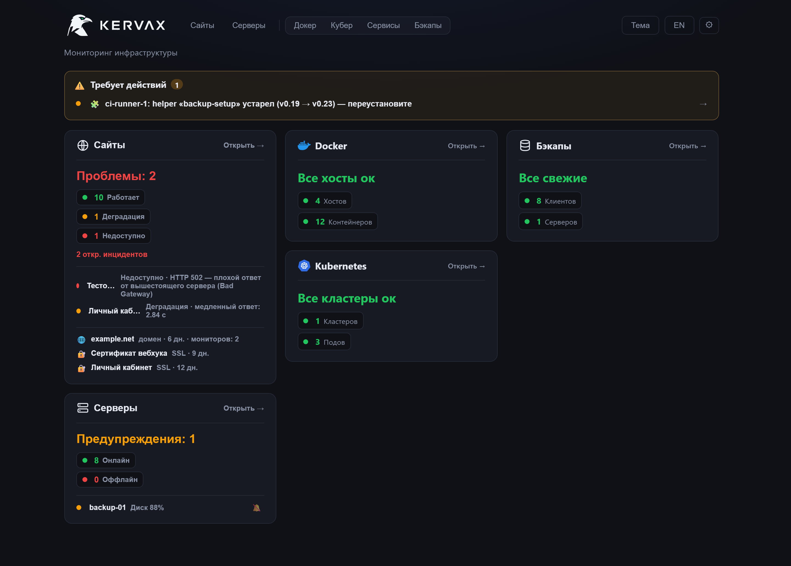
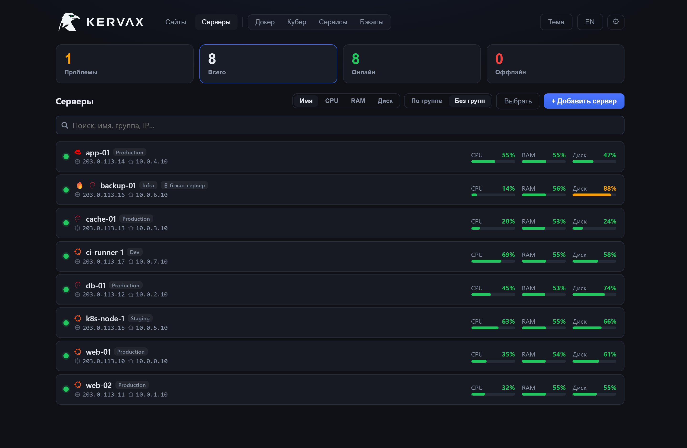
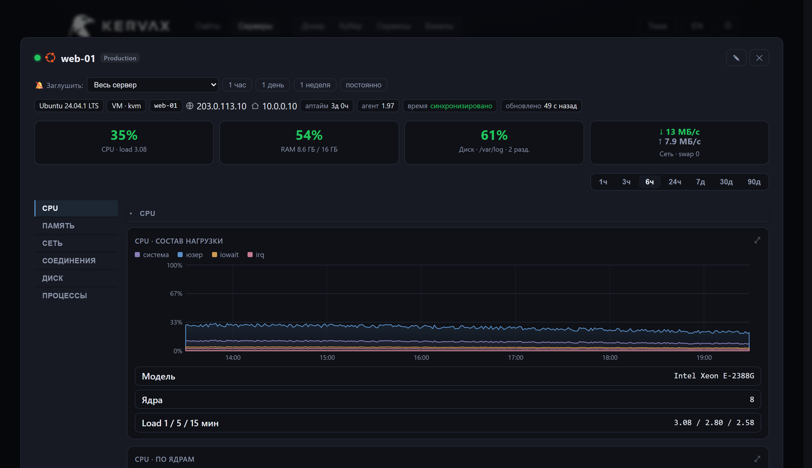
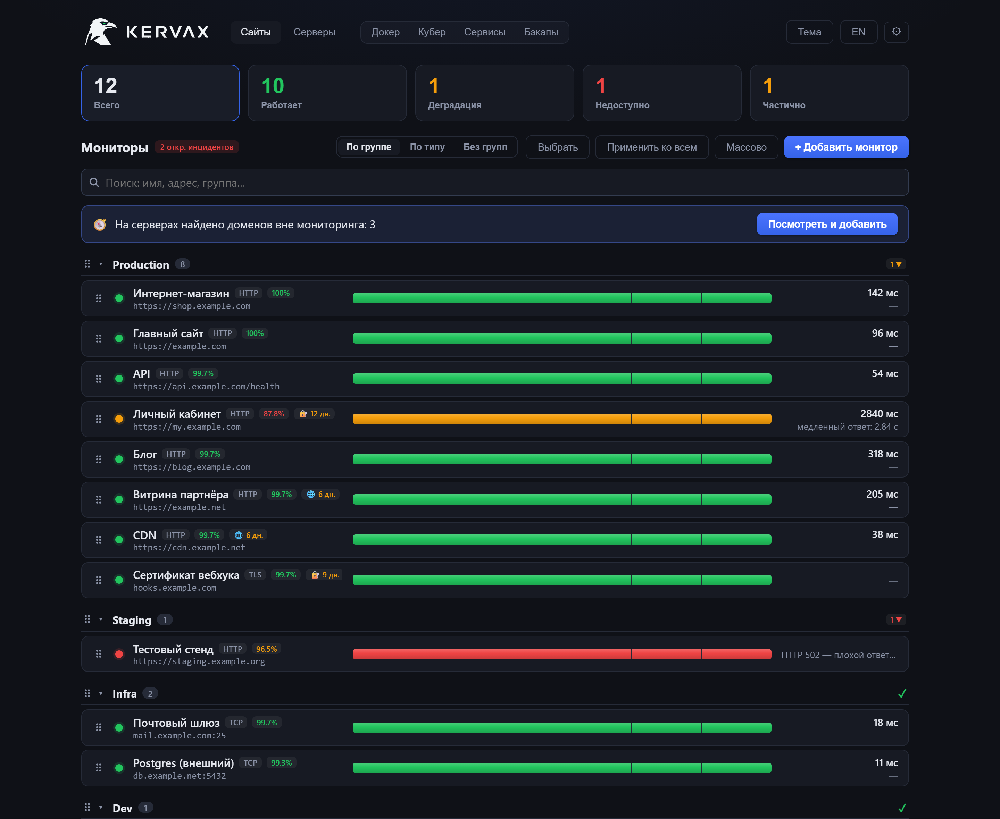
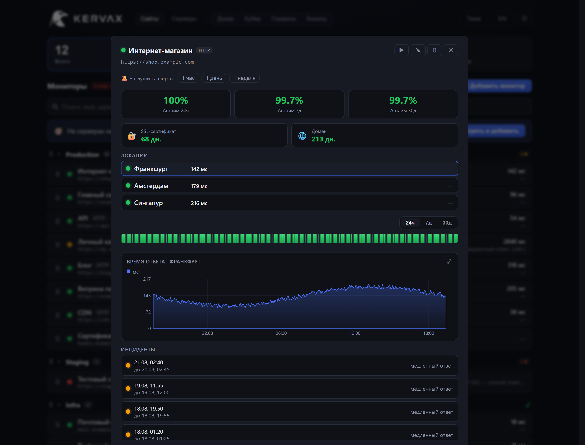
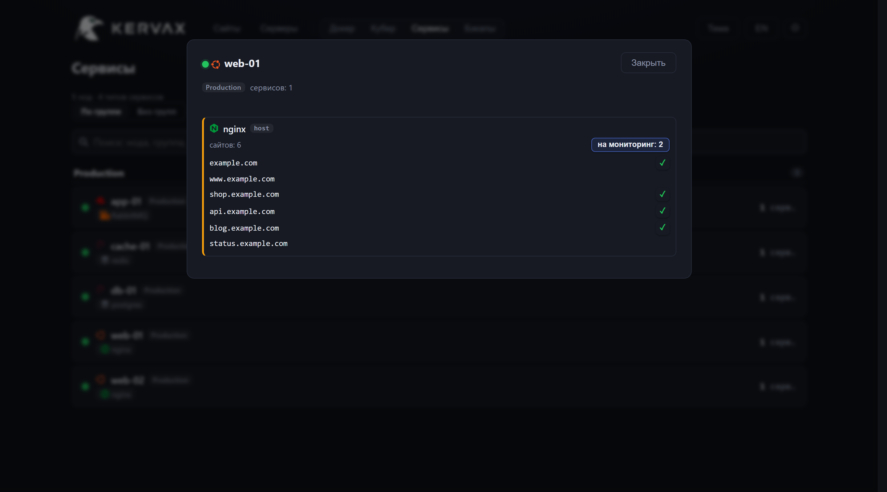
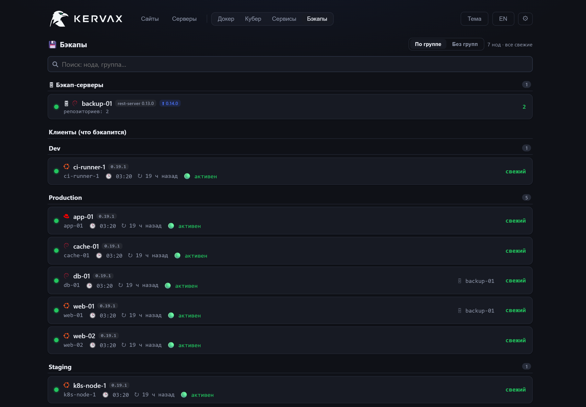

# Kervax

Мониторинг корпоративного уровня, который работает из коробки: сайты, серверы,
контейнеры, базы и бэкапы — в одной панели. Одна команда поднимает всё, агент сам
находит, что работает на машине, дашборды открываются заполненными, а алерты
приходят туда, где их читают.

Kervax смотрит на инфраструктуру с двух сторон сразу. Снаружи — как пользователь:
статус, ключевое слово, время ответа, сроки сертификата и домена, причём ещё и из
других регионов. Изнутри — через маленький агент, который ходит **наружу**, к
панели: порты ноды остаются закрытыми, а от токена агента панель хранит только
хеш.

[English version](README.md) · [kervax.ru](https://kervax.ru) · [Инструкция по установке](docs/install.ru.md) · [Зачем ещё одна панель](docs/why.ru.md) · [Changelog](CHANGELOG.md)

```bash
curl -fsSL https://raw.githubusercontent.com/mihsergeev/Kervax/main/ops/quickstart.sh | sudo sh
```

Эта команда поставит Docker (если его нет), поднимет Caddy с настоящим
сертификатом Let's Encrypt и напечатает адрес панели с паролем администратора.
Свой домен не нужен: без него панель поднимется на `<IP-сервера>.sslip.io`.



<table>
<tr>
<td width="50%"><a href="docs/img/ru/servers.png"></a><br><sub>Серверы — весь парк сразу и чем он реально занят</sub></td>
<td width="50%"><a href="docs/img/ru/server-detail.png"></a><br><sub>Деталь сервера — CPU, память, диски, сеть, процессы</sub></td>
</tr>
<tr>
<td width="50%"><a href="docs/img/ru/sites.png"></a><br><sub>Сайты — аптайм, сертификаты, домены, частичная доступность</sub></td>
<td width="50%"><a href="docs/img/ru/site-detail.png"></a><br><sub>Деталь монитора — аптайм, время ответа по локациям, инциденты</sub></td>
</tr>
</table>

<sub>Скриншоты сняты с работающей панели, наполненной демо-данными, — тот же
фронтенд, что уходит в образ. Все хосты, домены и адреса в них вымышлены
(RFC 2606 / RFC 5737), см. <a href="docs/make-shots.py">docs/make-shots.py</a>.</sub>

---

## Что она делает

**Сайты — проверка снаружи.** HTTP(S) с автоопределением схемы, ожидаемым
статусом и ключевым словом, которое должно (или не должно) встретиться; TCP-порты;
сроки TLS-сертификата и регистрации домена. Повторы и «алерт после N неудач
подряд» настраиваются на каждый монитор, поэтому одиночный сетевой блип никого
не будит.

**Не из одной точки.** Добавьте прокси-локации — и тот же монитор пойдёт ещё и
через них. Когда сайт отвечает вам, но не отвечает из Сингапура, панель говорит
**частично** и называет локацию, а не рисует зелёный кружок; и она же скажет,
если сломалась сама точка проверки.

**Сроки, о которых узнаёшь вовремя.** Напоминания по TLS и домену эскалируют
(14 / 7 / 1 день), считаются целыми днями и группируются по имени, которое вы на
самом деле продлеваете: пять мониторов на `*.example.com` — это один домен и одно
предупреждение, а не пять.

**Серверы — агентом, который ходит наружу.** Один статический Go-бинарь шлёт CPU
(с разбивкой и по ядрам), память и swap, диски по разделам, сеть по интерфейсам,
дисковый ввод-вывод, сокеты и conntrack, температуру, троттлинг, OOM-килы,
перезагрузки и топы процессов. Работает под непривилегированным пользователем
`kervax` в systemd с `NoNewPrivileges` и не слушает ни одного порта.

**Что на этих серверах крутится.** Контейнеры Docker и поды Kubernetes,
веб-серверы и сайты, которые они обслуживают, СУБД и размеры баз, глубина
очередей RabbitMQ. Домены, найденные на nginx ноды или в Ingress, ставятся на
мониторинг в два клика — панель показывает, что нашла и что из этого уже под
присмотром.



**Бэкапы.** Статус restic-бэкапов по нодам, репозитории на вашем rest-server,
уложился ли бэкап в ночное окно, и сейф доступов для восстановления, который
шифруется **в браузере**: пароль сейфа панель не знает, поэтому дамп её базы
ничего не даёт.



**Она сама говорит, что надо сделать.** Устаревший helper на ноде, агент старее
релиза, отвалившаяся точка проверки, разъехавшиеся часы — всё это попадает в
«Требует действий», а не тихо деградирует. Панель мониторинга, которая незаметно
перестала что-то замечать, хуже, чем её отсутствие.

**Алерты, с которыми можно жить.** Telegram или webhook, редактируемый текст по
каждому типу, область «все / группа / выбранные»; алерт по превышению, которое
ДЕРЖИТСЯ, а не по спайку; снуз, точечное приглушение сигнала и персональная
адресация — чтобы человеку приходило только то, за что он отвечает.

## Безопасность

- Агент ходит **наружу** по HTTPS. Панель никогда не устанавливает соединение к
  вашим серверам и хранит лишь SHA-256 токена агента.
- Панель не стартует с дефолтным или слабым секретом, пароль — от 12 символов.
  Вход — JWT плюс опциональный TOTP, с лимитом попыток и журналом действий.
- Ничего не работает от root: бэкенд — uid 10001, фронтенд — непривилегированный
  образ nginx, у всех контейнеров `no-new-privileges`.
- Роли проверяются в API, а не только в интерфейсе: аккаунт, ограниченный
  группой, не достанет чужой объект даже подбором id. Это держат две проверки —
  `ops/selfcheck.py` (статическая, гоняется в CI и как pre-commit хук) и
  `ops/audit_live.py`, который ходит по **работающей** панели временными
  аккаунтами всех ролей.
- Автообновление агентов, если его включить, держится на **офлайн**-ключе
  подписи, а не на доверии к панели: даже полностью захваченная панель не
  заставит агенты выполнить произвольный код.
- О чём стоит знать: кто может завести монитор, тот может направить его на любой
  URL, доступный панели, включая внутренние адреса. Тело ответа в интерфейс не
  попадает (только код статуса и совпало ли ключевое слово), но роль `editor`
  стоит считать доверенной.

Модель угроз и замечания по развёртыванию: [docs/security.md](docs/security.md).

## Из коробки

Стек на Prometheus — это конструктор: экспортер на каждую задачу, scrape-конфиг,
правила, маршруты Alertmanager и по дашборду на каждую вещь, которую хочется
видеть. Это гибко — и это выходные. Kervax предлагает другой размен: те же
задачи, но уже соединённые между собой.

| Чтобы получить | В Kervax | В обычном стеке |
| --- | --- | --- |
| Метрики нового сервера | одна команда на ноде, данные через секунды | поставить node_exporter, добавить цель в scrape-конфиг (или настроить service discovery), перечитать конфиг, импортировать дашборд |
| Проверку сайта снаружи | ввести адрес | blackbox_exporter, job с relabeling, правило, панель |
| Срок TLS-сертификата | считается сам, с эскалацией напоминаний | blackbox-проба плюс правило на PromQL |
| Срок регистрации домена | считается сам | из коробки никак — писать свой экспортер |
| Аптайм за 30 дней | цифра на карточке | recording rule и запрос на PromQL |
| Инциденты | открываются и закрываются сами, с историей | Alertmanager: маршруты, группировка, подавления, silence — в конфигах |
| Контейнеры, поды, СУБД, очереди | агент находит сам | cAdvisor, kube-state-metrics, postgres_exporter, rabbitmq_exporter… |
| Состояние бэкапов | статус restic по каждой ноде, в панели | не покрыто |
| Кто что видит | роли и группы, проверяются в API | организации в Grafana плюс отдельный доступ к Prometheus |
| Хранение | чистится по заданному сроку | настройка retention, а дальше Thanos/Mimir |
| Дашборды | уже есть при первом входе | собрать или импортировать |

Это не упрёк Prometheus: для прикладных метрик и произвольных запросов на PromQL
он остаётся лучшим инструментом, и вместе они прекрасно уживаются. Kervax
закрывает инфраструктуру — хост, сайт, сертификат, бэкап — и закрывает её без
отдельного проекта по настройке. **[Чего она намеренно не делает →
docs/why.ru.md](docs/why.ru.md)**

## Что нужно

- Сервер с Linux, Docker и Compose. Хватает 2 ГБ памяти.
- Свободные порты 80 и 443 — либо свой обратный прокси впереди.
- Никаких внешних сервисов: метрики, инциденты и история лежат в вашем Postgres.

## Быстрый старт

```bash
curl -fsSL https://raw.githubusercontent.com/mihsergeev/Kervax/main/ops/quickstart.sh | sudo sh
```

Docker (если нет), Caddy с сертификатом Let's Encrypt, случайные секреты, сама
панель — и адрес с паролем администратора в конце. Домен не обязателен: без него
панель поднимется на `<IP-сервера>.sslip.io`.

Хотите сделать всё руками, со своим доменом или за уже работающим прокси?
**[Подробная инструкция → docs/install.ru.md](docs/install.ru.md)** — там и
вайтлист по IP, и обновление, и что смотреть, если что-то не так.

## Настройки

Всё задаётся переменными окружения `KERVAX_*` — см. [.env.example](.env.example).
Те, что стоит выставить сразу: `KERVAX_PANEL_URL` (превращает алерты в ссылки
прямо на объект), `KERVAX_SCHEDULER_TICK`, `KERVAX_BACKUP_INTERVAL_HOURS`,
`KERVAX_SAMPLE_RETENTION_DAYS`.

## Масштабирование

Одного контейнера по умолчанию спокойно хватает на несколько сотен серверов.
Первым упирается не Postgres, а единственный веб-процесс: приём метрик, API и
планировщик делят одно ядро. Оверлей `compose.scale.yml` поднимает API
несколькими воркерами uvicorn и выносит планировщик в отдельный процесс:

```sh
# KERVAX_WEB_WORKERS ≈ числу vCPU; держите воркеры × ~15 соединений к БД < 100
docker compose -f compose.yml -f compose.scale.yml up -d --build
```

Postgres в `compose.yml` уже настроен под тайм-серии (память, autovacuum,
составные индексы, ежечасная чистка). Метрики редкие и низкокардинальные, так что
обычный Postgres здесь — правильное хранилище; если перерастёте, меняйте образ на
**TimescaleDB**, а не прикручивайте отдельную time-series базу.

## Подписанные обновления агента (опция, по умолчанию выключено)

По умолчанию агенты не обновляются сами — нода обновляется повторным запуском
своей команды установки. Вместо этого можно включить обновление по воздуху, в
котором панели *не* доверяют раздавать код: релизы подписываются офлайн ключом,
который никогда не попадает на сервер, а агент ставит обновление, только если
сошлась подпись, версия строго новее (защита от отката) и SHA-256 бинаря
совпадает с подписанным манифестом.

```sh
python agent-signing/keygen.py             # спросит пароль, напечатает публичный ключ
#   впишите его в .env как KERVAX_AGENT_PUBKEY и передеплойте — агенты соберутся с ним
python agent-signing/release.py 1.1        # сборка, хеши, подпись → agent-dist/
docker compose up -d --build
```

Дальше раскатка со страницы **Серверы**: плашка предлагает **Канарейку — 1 ноду**
или **Обновить все**, у каждой ноды есть своя кнопка. Только для админа и с
записью в журнал. Приватный ключ (`agent-signing/kervax-agent.key`) — корень
доверия: держите его вне панели, в git он уже игнорируется, и храните вместе с
паролем в менеджере паролей. Потеря ключа означает новый ключ и переустановку
агента на всех нодах.

Подробное руководство: [docs/agent-releases.md](docs/agent-releases.md).

## Самоконтроль

Панель мониторинга не может сообщить о собственной смерти, поэтому нужен внешний
наблюдатель. Планировщик раз в минуту пишет heartbeat (метку времени,
самопроверку канала алертов и его реквизиты); хостовый вотчдог читает этот пульс
и алертит **независимо**, если встали панель, планировщик, база или сам канал
алертов:

```bash
install -D -m755 ops/panel-watchdog.sh /lib65/kervax/panel-watchdog.sh
echo '*/5 * * * * root /lib65/kervax/panel-watchdog.sh' > /etc/cron.d/kervax-watchdog
```

Чтобы пережить и смерть самого хоста, запускайте тот же скрипт со второй машины,
куда синхронизируется файл heartbeat.

## Разработка

```sh
cd backend && python -m venv .venv && . .venv/Scripts/activate   # или bin/activate
pip install -e .[dev] && pytest -q
cd ../frontend && npm ci && npm run dev
```

- Бэкенд: FastAPI, SQLAlchemy 2 async, Alembic, PostgreSQL (SQLite в тестах).
- Фронтенд: React 19 + Vite + TypeScript, самописные SVG-графики, свой i18n.
  Перед отправкой — `npx tsc -p tsconfig.app.json --noEmit`.
- Агент: один Go-файл без CGO (`agent/main.go`).
- `python ops/selfcheck.py` — статические проверки согласованности; гоняются в CI
  и как pre-commit хук (`git config core.hooksPath ops/hooks`).
- `python docs/make-shots.py` — пересобирает скриншоты README с живой панели,
  наполненной демо-данными.

## Лицензия

[AGPL-3.0](LICENSE). Если вы запускаете изменённую версию как сетевой сервис, вы
обязаны предоставить пользователям её исходный код.
